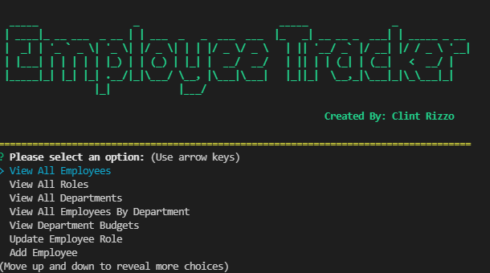
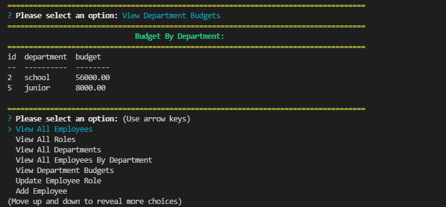

# Employee-Tracker-Database
A complete backend project using node.js and MySQL (no deployed site). This backend application uses user input from inquirer to populate an employee database. When the user adds an employee they will be asked which deparment that employee will be working in, salary, and who their supervisor is. If you add a new department the information will be stored in the department selection. 

## :bookmark_tabs: Table of Contents
* [languages-used]
* [installation]
* [Usage]
* [images]
* [video]

## languages-used
1. node.js
2. MySQL

## installation
1. npm init
2. npm install inquirer
3. npm install console.table
4. npm install figlet
5. npm install chalk
6. npm install dotenv

## usage
in the terminal run npm start then the user will be able to add, update, or delete. See the video below to see how the backend application works. 

## images
 

## video
Take a look at my youtube channel to see how the application works through the terminal
[employeetracker](https://www.youtube.com/watch?v=ahixbcV90wQ)
